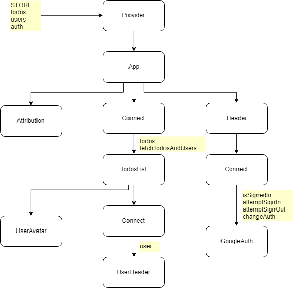

## Tasks app

Practicing how to fetch data in a Redux app, write async action creators, use redux-thunk, avoid overfetching, write action creators in action creators, handle authentication. 
This is an app which shows a list of tasks (data from JSONPlaceholder API).

#### App

#### App layout

#### App structure

#### Auth flow

#### Stack

-   React
-   Redux
-   React-Redux
-   Redux-Thunk
-   Axios
-   JSONPlaceholder API
-   Lodash
-   Semantic UI
-   Google API client library (auth2)
-   Redux DevTools extension
